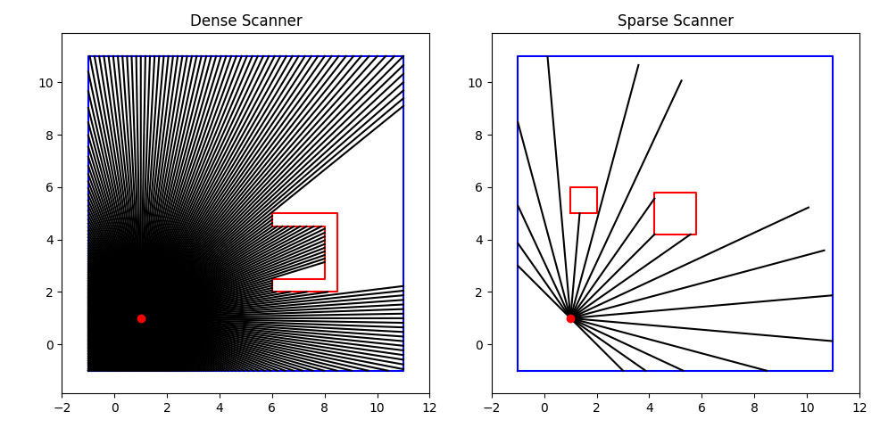

# Python Laser Scanner / Lidar Simulator
A small [laser scanner]/[lidar] simulator in Python. The main dependency is `shapely` for the geometry operations.



# Dependencies
- `Numpy`
- `Shapely`
- `Matplotlib` (optional, for visualization)

# Quickstart
After installing the dependencies, you can run the example with (under the root directory):
```bash
python src/test_scanner.py
```

# Usage

## LaserScanOutput
The format (data class) of the output of the laser scanner. This part is in the order of:
- Properties
- Configuration to initialize the object
- Steps to use the object

### property
- angles: A tuple of the (float) angles of the beams.
- angles_deg: Similar to `angles`, but in degrees.
- state: The state of the object, (x, y, theta).
- ranges: A list of the (float) ranges/distances of the beams.
- beam_end_points: A list of the (x, y) coordinates of the endpoints of the beams.

### Configuration
It contains the following fields, similar to the [ROS message] `sensor_msgs/LaserScan`:
- angle_min (float): The minimum angle of the scan.
- angle_max (float): The maximum angle of the scan.
- angle_increment (float): The angular resolution of the scan.
- range_min (float): The minimum range of the scan.
- range_max (float): The maximum range of the scan.
- frame_id (str): The frame id of the scan.

### Steps
1. This object can be initialized from a dictionary containing the same fields, by calling `LaserScanOutput.from_config(...)`.
2. Initialize the object by telling its initial state, by calling `init_beams(...)`.
3. Update the object by calling `update_ranges_and_beams(...)`.

## LaserScanner