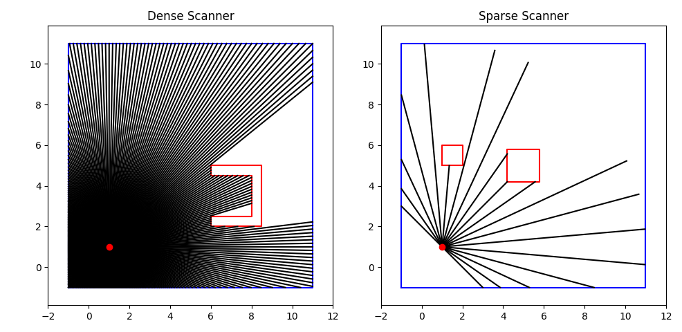

# Python Laser Scanner / Lidar Simulator

A compact 2D laser scanner (lidar) simulator in Python, with two map backends:

- Geometric maps (polygon boundary + polygon obstacles)
- Occupancy maps (2D boolean grid)

The scanner output format is inspired by ROS `sensor_msgs/LaserScan`.



## Requirements

- Python >= 3.11
- numpy
- shapely
- matplotlib
- pyyaml

Dependencies are managed in `pyproject.toml`.

## Install

This project uses [uv](https://docs.astral.sh/uv/):

```bash
uv sync
```

The denpendency can also be installed with pip:

```bash
pip install -r requirements_short.txt
```

## Project Layout

```text
src/
	laser_scanner/	# scanner implementations & output dataclass
	basic_map/		# geometric and occupancy map
demos/				# runnable visualization demos
tests/				# unit tests
config/				# scanner specs (yaml)
data/				# sample geometric maps (json)
```

## Quick Start

Run the scan demo on a geometric and occupancy map:

```bash
python demos/demo_scan.py --map-type geo
python demos/demo_scan.py --map-type occ
```

Generate and visualize a random map:

```bash
python demos/demo_random_map.py --map-type geo --complexity 3 --seed 0
python demos/demo_random_map.py --map-type occ --complexity 3 --seed 0
```

## Run Tests

With pytest:

```bash
pytest tests -v
```

## Usage

### Unified Scanner API

Use `LaserScanner` when you want one interface for both map types.

Basic flow:

1. Build scanner from YAML (`from_yaml`).
2. Load a map (`load_map`) to select backend automatically.
3. Initialize scanner pose (`load_scanner`).
4. Call `scan(...)` each step to get a `LaserScanOutput`.

Minimal example:

```python
from laser_scanner.laser_scanner import LaserScanner
from basic_map.map_geometric import GeometricMap

scanner = LaserScanner.from_yaml("config/dense_scanner_spec.yaml")
geo_map = GeometricMap.from_json("data/test_map_1/map.json")

scanner.load_map(geo_map)
scanner.load_scanner((1.0, 1.0), 0.0)
scan = scanner.scan(0.0, [1.0, 1.0, 0.0])

print(scan.ranges[:5])
```

### `LaserScanOutput`

Core fields:

- `angles`: tuple of beam angles (rad)
- `angles_deg`: tuple of beam angles (deg)
- `state`: scanner state `[x, y, heading]`
- `ranges`: range for each beam
- `beam_end_points`: endpoint `(x, y)` for each beam

The beam order is from `angle_min` to `angle_max`.

Configuration fields:

- `angle_min`
- `angle_max`
- `angle_increment`
- `range_min`
- `range_max`
- `frame_id`

## Acknowledgment

This implementation is based on [DQN-Boosted MPC for Collision-Free Navigation of Mobile Robots](https://github.com/Woodenonez/TrajTrack_MPCnDQN_RLBoost), with the paper available at [IEEE CASE 2023](https://ieeexplore.ieee.org/document/10260515).